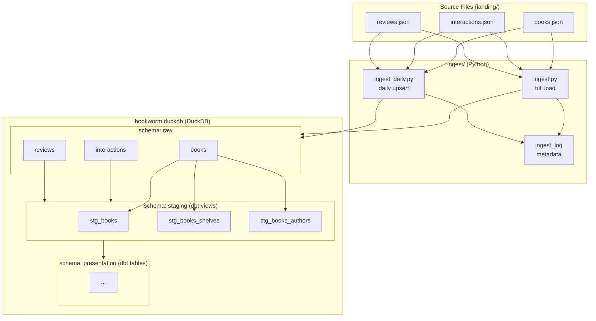

# duck_dwh

A local data warehouse built with DuckDB and dbt, using Goodreads mystery/thriller/crime data.

## Architecture



## Project Structure

```
duck_dwh/
├── ingest/
│   ├── ingest.py          # One-time full load into raw schema
│   └── ingest_daily.py    # Daily upsert by date-partitioned files
├── bookworm/              # dbt project
│   ├── models/
│   │   └── staging/       # Staging views (cleaning, typing, unnesting)
│   └── macros/
├── orchestrate/
│   └── run.sh             # Runs ingest + dbt build
├── storage/
│   └── bookworm.duckdb    # DuckDB database (gitignored)
└── landing/               # Raw JSON source files (gitignored)
```

## Setup

### 1. Prerequisites

- Python 3.12+ with pyenv
- Git

### 2. Clone and create virtual environment

```bash
git clone <repo-url>
cd duck_dwh
python -m venv .venv
source .venv/bin/activate
pip install duckdb dbt-duckdb
```

### 3. Configure dbt profile

Create `~/.dbt/profiles.yml`:

```yaml
bookworm:
  outputs:
    dev:
      type: duckdb
      path: ../storage/bookworm.duckdb
      threads: 1
  target: dev
```

### 4. Add source data

Place Goodreads JSON files in `landing/`:

```
landing/
├── goodreads_books_mystery_thriller_crime.json
├── goodreads_interactions_mystery_thriller_crime.json
└── goodreads_reviews_mystery_thriller_crime.json
```

## Running

### Full pipeline (ingest + dbt)

```bash
bash orchestrate/run.sh
```

### Ingest only

```bash
source .venv/bin/activate
python ingest/ingest.py
```

### dbt only

```bash
source .venv/bin/activate
cd bookworm
dbt build --select staging
```

### Daily ingest (date-partitioned files)

```bash
source .venv/bin/activate
python ingest/ingest_daily.py
```

Expects files under `landing/<table>/YYYY-MM-DD/`.

## Schemas

| Schema       | Description                              |
|--------------|------------------------------------------|
| `raw`        | Raw data loaded directly from JSON files |
| `staging`    | Cleaned and typed views built by dbt     |
| `presentation` | Final tables for analysis (dbt)        |

## Checking ingest logs

```sql
SELECT * FROM raw.ingest_log ORDER BY ingested_at DESC;
```
